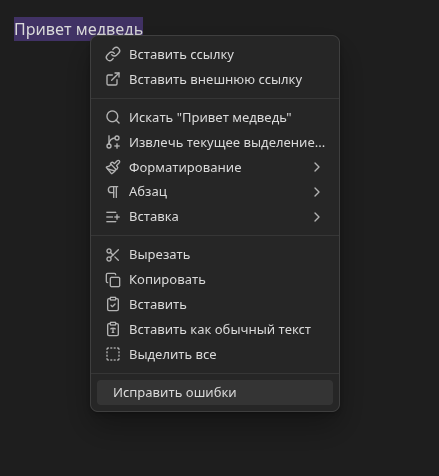
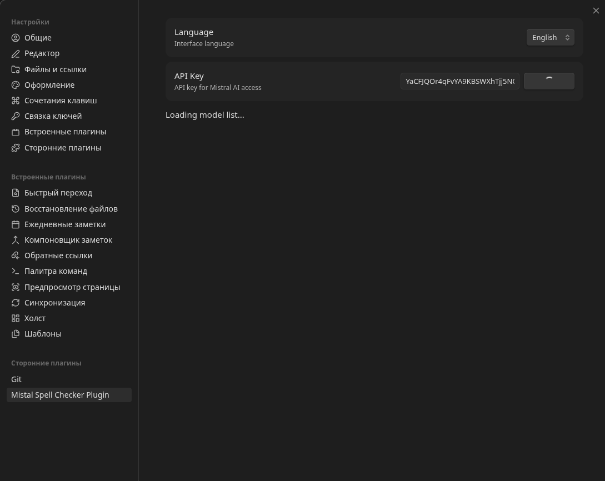
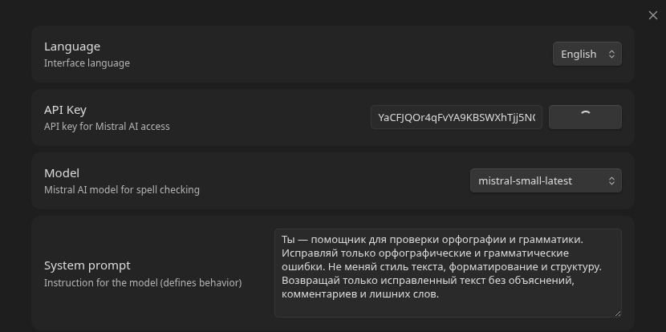

# Mistral Spell Checker Plugin

Плагин для [Obsidian](https://obsidian.md), который проверяет и исправляет орфографию в тексте с помощью Mistral AI.

## Возможности

- Исправление орфографических и грамматических ошибок в выделенном тексте через контекстное меню или палитру команд
- Выбор модели Mistral AI в настройках
- Настраиваемый системный промпт
- Локализация интерфейса (русский / английский)
- Проверка API-ключа в настройках

## Скриншоты

| Контекстное меню | Настройки |
|---|---|
|  |  |

| Модальное окно |
|---|
|  |

## Команды

| Команда | ID | Где доступна |
|---|---|---|
| Исправить ошибки | `mistral-fix-spelling-errors` | Палитра команд, контекстное меню редактора |
| Open modal (simple) | `open-modal-simple` | Палитра команд (демо) |
| Open modal (complex) | `open-modal-complex` | Палитра команд (демо, только в режиме просмотра Markdown) |

## Установка

### Вручную

1. Скачайте `main.js`, `manifest.json`, `styles.css` из [релизов](https://github.com/saintbyte/obsidian_mistal_spell_checker/releases)
2. Скопируйте файлы в `<Ваш_хранилище>/.obsidian/plugins/mistral-spell-checker-plugin/`
3. В Obsidian перейдите в **Настройки → Community plugins**, включите плагин

### Разработка

```bash
git clone https://github.com/saintbyte/obsidian_mistal_spell_checker
cd obsidian_mistal_spell_checker
npm install
npm run dev    # разработка с автопересборкой
npm run build  # production-сборка
npm run lint   # проверка кода ESLint
```

Собранный `main.js` появится в корне проекта. Для тестирования скопируйте `main.js`, `manifest.json`, `styles.css` в `<хранилище>/.obsidian/plugins/mistral-spell-checker-plugin/` и перезагрузите Obsidian.

## Архитектура

```
src/
├── main.ts       # Точка входа: lifecycle, команды, контекстное меню
├── settings.ts   # Интерфейс настроек, дефолты, вкладка настроек
├── mistral.ts    # Клиент Mistral AI API
└── i18n.ts       # Локализация (ru/en)
```

Сборка: esbuild → единый `main.js` (CommonJS). Obsidian и CodeMirror — внешние зависимости, предоставляются средой.

## Технологии

- **TypeScript** (strict mode, ES2021)
- **Obsidian API** (типы `obsidian`)
- **Mistral AI SDK** (`@mistralai/mistralai`)
- **esbuild** — сборщик
- **ESLint** с `eslint-plugin-obsidianmd` — статический анализ

## Лицензия

0-BSD — см. [LICENSE](LICENSE).
